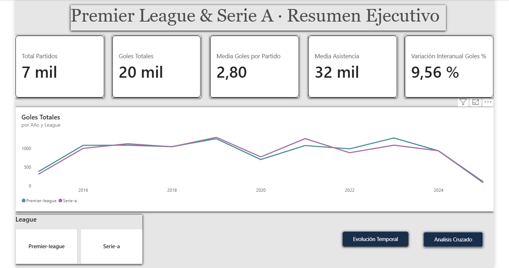
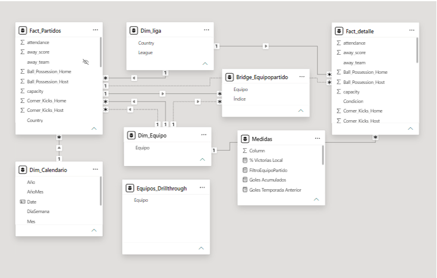
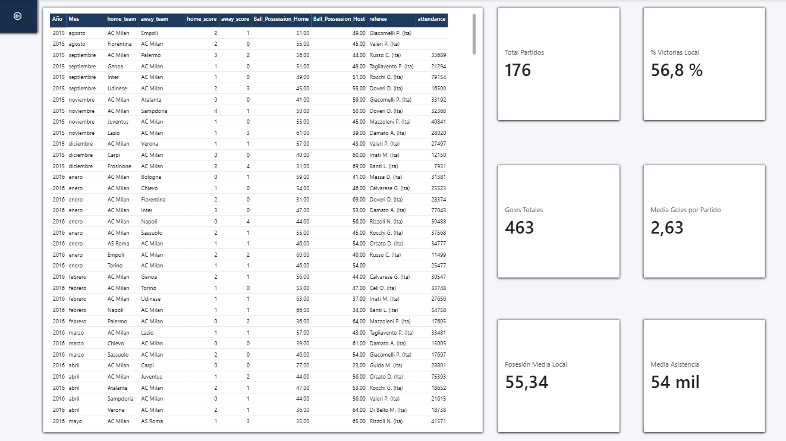

# ⚽ Análisis de partidos de fútbol: Premier League y Serie A

Dashboard interactivo en **Power BI** para analizar el rendimiento de los equipos de la **Premier League** y la **Serie A** a lo largo de **10 temporadas** (2015/2016 – 2024/2025).



## 📌 Objetivo

Ofrecer una visión clara de la evolución de goles, asistencia y rendimiento por equipo, con la posibilidad de explorar el detalle de cada club mediante filtros, marcadores y drillthrough.

## 📊 Dataset

- **Fuente:** [Football Match Statistics (Kaggle)](https://www.kaggle.com/)
- **Original:** 18 ligas y 25 temporadas (2000/2001 – 2024/2025)
- **Acotado a:** Premier League y Serie A, últimas 10 temporadas (380 partidos por temporada y liga)

> **Nota sobre la elección de ligas:** en un primer momento se eligió LaLiga junto a la Premier League, pero en el dataset solo tenía ~105-110 partidos por temporada (~28 % de los 380 esperados), así que se sustituyó por la Serie A, que sí tiene cobertura completa.

> **Limitación:** la temporada 2024/2025 está incompleta (datos hasta finales de enero de 2025), por lo que sus totales deben interpretarse con cautela.

## 🧹 Transformaciones en Power Query

- Filtrado por liga (`Premier-league`, `Serie-a`) y por las 10 temporadas más recientes.
- **Reconstrucción de la fecha completa:** `Date_day` solo traía día y mes (ej. `3.11`). Se creó una columna que añade el año según la temporada: mes ≥ julio → primer año; mes < julio → segundo año. Se gestionaron los nulos.
- Eliminación de columnas de texto con listas de eventos (goleadores, tarjetas, sustituciones), conservando las estadísticas numéricas (posesión, tiros, córners, faltas, tarjetas, xG…).
- **Corrección regional:** el punto decimal se leía como separador de miles (`3.0` → `30`). Se solucionó convirtiendo los tipos con la configuración regional *Inglés (Estados Unidos)*.
- Conversión de la posesión (texto con `%`) a valor numérico.

## 🗂️ Modelo de datos

Esquema en **estrella** con una tabla de hechos y tres dimensiones:

| Tabla | Tipo | Descripción |
|---|---|---|
| `Fact_Partidos` | Hechos | Un registro por partido: equipos, resultado, fecha, liga y estadísticas |
| `Dim_Equipo` | Dimensión | Equipos únicos (locales + visitantes) |
| `Dim_Liga` | Dimensión | Ligas y países |
| `Dim_Calendario` | Dimensión | Tabla de fechas creada con DAX (`CALENDAR`) |

**Relaciones:** todas *varios a uno* (`*:1`) con filtro en una sola dirección. La relación con el equipo visitante (`away_team`) está **inactiva** para evitar ambigüedad y se activa puntualmente con `USERELATIONSHIP`.




## 🧮 Medidas DAX

10 medidas organizadas en una tabla independiente (`Medidas`):

| Medida | Descripción |
|---|---|
| Total Partidos | Nº de partidos en el contexto actual |
| Goles Totales | Goles del equipo local + visitante |
| Media Goles por Partido | Goles Totales / Total Partidos |
| Media Asistencia | Media de espectadores por partido |
| xG Total | Goles esperados de ambos equipos |
| Posesión Media Local | Media de posesión del equipo local |
| % Victorias Local | % de partidos ganados como local |
| Goles Temporada Anterior | Mismo periodo del año anterior (`SAMEPERIODLASTYEAR`) |
| Variación Interanual Goles % | Variación porcentual respecto al año anterior |
| Goles Acumulados | Acumulado del año (`DATESYTD`) |

## 📄 Páginas del informe

1. **Resumen ejecutivo:** KPIs principales, evolución de goles por liga y año, y segmentación por liga en botones.
2. **Evolución temporal:** estacionalidad de goles por mes, variación interanual con color condicional (verde/naranja) y goles acumulados por año natural.
3. **Análisis cruzado Equipo × Liga:** matriz de rendimiento por equipo y ranking Top 10 de goleadores, con drillthrough y marcador para mostrar/ocultar filtros.
4. **Detalle:** listado completo de partidos del equipo seleccionado (como local y visitante).




## ⚙️ Funcionalidades destacadas

- **Drillthrough** desde *Análisis cruzado* hacia *Detalle*.
- **Marcadores** con botón de alternancia (*Filtro Visible / Filtro Oculto*).
- **Inteligencia de tiempo** con `SAMEPERIODLASTYEAR` y `DATESYTD`.
- **Formato condicional** en la variación interanual.

### 🔧 Reto técnico: drillthrough con equipo local y visitante

Como solo estaba activa la relación con `home_team`, el drillthrough mostraba únicamente los partidos como local. La solución fue crear una **tabla independiente** para la página de Detalle, sin relaciones con el resto del modelo, y aplicarle un filtro basado en una **medida DAX** que compara el equipo seleccionado con las columnas de local y visitante. Así se recuperan los partidos en ambas condiciones sin alterar el resto del modelo.

## 💡 Aprendizajes

- La mayor dificultad estuvo en el **modelado de datos**, no en el diseño visual: relaciones activas/inactivas y contexto de filtro.
- Detectar y **documentar las limitaciones de los datos** (cobertura de LaLiga, ausencia de partidos en octubre, temporada 2024/2025 incompleta) en lugar de ignorarlas.

## 🛠️ Tecnologías

`Power BI` · `Power Query` · `DAX` · `Modelado en estrella`

## 📁 Estructura del proyecto

```
├── TrabajoPBI.pbix
├── data/
├── images/
├── Potenciano_Adrian_TrabajoPBI_Documento.pdf
└── README.md
```

## 👤 Autor

**Adrián Potenciano** · [GitHub](https://github.com/Potenjr)
